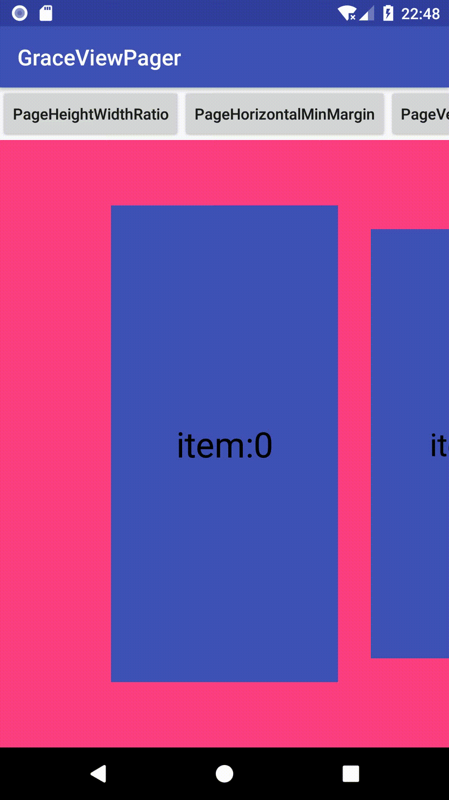

# GraceViewPager

[ ](https://bintray.com/wrs/maven/GraceViewPager/_latestVersion)

## 背景

`ViewPager`在实际项目使用过程中，出现数据刷新使用姿势不正确、动画偏移、动态修改`width、paddingLeft、paddingRight、pageMargin`导致当前page滚动位置定位异常。于是通过源码分析，解决这些问题，并对使用场景进行了封装。

可以通过下面的文章了解`ViewPager`为何会出现这些问题以及对应的解决方案：

1. [ViewPager源码分析（发现刷新数据的正确使用姿势）](https://blog.csdn.net/wurensen/article/details/81390641)
2. [解决ViewPager动画异常（数据刷新、padding、pageMargin）](https://blog.csdn.net/wurensen/article/details/81544776)

## 简介


可实现如下效果：



## 主要功能

1. 支持ViewPager按需添加、删除视图，以及局部刷新； 

2. 修复多场景下ViewPager.PageTransformer返回的position错误，让开发者专注于动画实现； 

3. 修复ViewPager的width、paddingLeft、paddingRight、pageMargin动态改变导致当前page滚动位置定位异常的问题； 

4. 提供自定义的ViewPager：GraceViewPager，可快速实现一屏显示多Page的功能。

## 使用方式

`build.gradle`添加依赖：

```groovy
// 确保仓库已添加jcenter()
allprojects {
    repositories {
        ...
        jcenter()
    }
}

// 添加依赖
dependencies {
	compile 'com.lancewu:graceviewpager:<version>' 
}
```

`<version>`请替换为对应的版本号。

### 1.直接使用GraceViewPager

推荐直接使用`GraceViewPager`来替代`ViewPager`，在布局中直接使用：

```xml
<!--注意：不要设定padding-->
<com.lancewu.graceviewpager.GraceViewPager
        android:id="@+id/vp"
        android:layout_width="match_parent"
        android:layout_height="match_parent"
        android:background="@color/colorAccent"
        app:gvp_pageHorizontalMinMargin="50dp"
        app:gvp_pageHeightWidthRatio="2"
        app:gvp_pageVerticalMinMargin="50dp" />
```

自定义属性说明：

| 自定义属性                  | 说明                                                         |
| --------------------------- | ------------------------------------------------------------ |
| gvp_pageHeightWidthRatio    | page高宽比例值：如2，代表page的 高:宽=2:1，负数和0表示不需要按照比例 |
| gvp_pageHorizontalMinMargin | page水平最小边距，指显示page与ViewPager水平方向间的最小间距；当按比例设定时，高度可能不足以容纳，此时就要缩小宽度，增加间距，即最后的padding值会大于该设定值 |
| gvp_pageVerticalMinMargin   | page垂直最小边距，指显示page与ViewPager垂直方向间的最小间距； 当按比例设定时，宽度可能不足以容纳，此时就要缩小高度，增加间距，即最后的padding值会大于该设定值 |

继承`GracePagerAdapter`，声明了泛型来表示`item`的实体类型：

```java
private class Adapter extends GracePagerAdapter<String> {

    Adapter(@NonNull List<String> items) {
        super(items);
    }

    @NonNull
    @Override
    protected View instantiateItemView(@NonNull ViewGroup container, String item, int position) {
        return getLayoutInflater().inflate(R.layout.page_item, container, false);
    }

    @Override
    protected void bindItemView(@NonNull View itemView, String item, int position, boolean first) {
        TextView tv = itemView.findViewById(R.id.tv);
        tv.setText(item);
    }

}
```

把`GracePagerAdapter`实例设置给`GraceViewPager`：

```java
mViewPager.setGraceAdapter(mAdapter);
```

添加页面切换动画，只需要继承`GracePageTransformer`：

```java
private class Transformer extends GracePageTransformer {

    private static final float SCALE = 0.9f;

    Transformer(@NonNull GracePagerAdapter pagerAdapter) {
        super(pagerAdapter);
    }

    @Override
    public void transformPageWithCorrectPosition(@NonNull View page, float position) {
        if (position >= -1 && position <= 1) {
            // [-1,1]，中间以及相邻的页面，一般相邻的才会用于计算动画
            float scale = SCALE + (1 - SCALE) * (1 - Math.abs(position));
            page.setScaleX(scale);
            page.setScaleY(scale);
        } else {
            // [-Infinity,-1)、(1,+Infinity]，超出相邻的范围
            page.setScaleX(SCALE);
            page.setScaleY(SCALE);
        }
    }

}
```

然后给`GraceViewPager`设置动画：

```java
mViewPager.setGracePageTransformer(false, new Transformer(mAdapter));
```

如果需要动态修改相关属性，也提供了对应的API：

```java
// 动态修改比例
mViewPager.setPageHeightWidthRatio(ratio);
// 动态修改水平最小间距
mViewPager.setPageHorizontalMinMargin(horizontalMinMargin);
// 动态修改垂直最小间距
mViewPager.setPageVerticalMinMargin(verticalMinMargin);

// 修改pageMargin，请使用如下修正过滚动位置的方法
mViewPager.setGracePageMargin(pageMargin);
```

### 2.给ViewPager添加支持

如果不便于用`GraceViewPager`替换掉项目中已有的`ViewPager`，也提供对应的支持方式。

##### 添加一屏多页支持

支持对已有的`ViewPager`进行一屏多页的支持，首先去除布局中的padding属性：

```xml
<!--remove all padding attrs-->
<android.support.v4.view.ViewPager
    android:id="@+id/vp"
    android:layout_width="match_parent"
    android:layout_height="match_parent"
    android:background="@color/colorAccent" />
```

代码中创建一屏多页插件实例`GraceMultiPagePlugin`，并给`ViewPager`添加插件支持：

```java
GraceMultiPagePlugin mMultiPagePlugin;
// 添加一屏多页支持
mMultiPagePlugin = new GraceMultiPagePlugin.Builder(mViewPager)
    .pageHeightWidthRatio(2f)
    .pageHorizontalMinMargin(dip2px(50))
    .pageVerticalMinMargin(dip2px(50))
    .build();
GraceViewPagerSupport.supportMultiPage(mViewPager, mMultiPagePlugin);
```

同时支持动态修改属性：

```java
// 修改比例
mMultiPagePlugin.setPageHeightWidthRatio(ratio);
// 修改水平最小间距
mMultiPagePlugin.setPageHorizontalMinMargin(horizontalMinMargin);
// 修改垂直最小间距
mMultiPagePlugin.setPageVerticalMinMargin(verticalMinMargin);
```

##### 添加布局变化后滚动位置修正

```java
// 添加布局变化支持修复滚动
GraceViewPagerSupport.supportLayoutChange(mViewPager);
```

##### 添加动态修改pageMargin后滚动位置修正

```java
// 动态修改pageMargin时使用该方法
GraceViewPagerSupport.setPageMargin(mViewPager, pageMargin);
```

##### 添加按需创建、销毁视图和动态刷新视图的PagerAdapter

```java
private class Adapter extends GracePagerAdapter<String> {

    Adapter(@NonNull List<String> items) {
        super(items);
    }

    @NonNull
    @Override
    protected View instantiateItemView(@NonNull ViewGroup container, String item, int position) {
        return getLayoutInflater().inflate(R.layout.page_item, container, false);
    }

    @Override
    protected void bindItemView(@NonNull View itemView, String item, int position, boolean first) {
        TextView tv = itemView.findViewById(R.id.tv);
        tv.setText(item);
    }

}
```

##### 使用修正的页面切换动画，专注于动画本身的实现

需要配合`GracePagerAdapter`使用：

```java
private class Transformer extends GracePageTransformer {

    private static final float SCALE = 0.9f;

    Transformer(@NonNull GracePagerAdapter pagerAdapter) {
        super(pagerAdapter);
    }

    @Override
    public void transformPageWithCorrectPosition(@NonNull View page, float position) {
        if (position >= -1 && position <= 1) {
            // [-1,1]，中间以及相邻的页面，一般相邻的才会用于计算动画
            float scale = SCALE + (1 - SCALE) * (1 - Math.abs(position));
            page.setScaleX(scale);
            page.setScaleY(scale);
        } else {
            // [-Infinity,-1)、(1,+Infinity]，超出相邻的范围
            page.setScaleX(SCALE);
            page.setScaleY(SCALE);
        }
    }

}
```

## License

```txt
   Copyright 2018 LanceWu

   Licensed under the Apache License, Version 2.0 (the "License");
   you may not use this file except in compliance with the License.
   You may obtain a copy of the License at

     http://www.apache.org/licenses/LICENSE-2.0

   Unless required by applicable law or agreed to in writing, software
   distributed under the License is distributed on an "AS IS" BASIS,
   WITHOUT WARRANTIES OR CONDITIONS OF ANY KIND, either express or implied.
   See the License for the specific language governing permissions and
   limitations under the License.
```